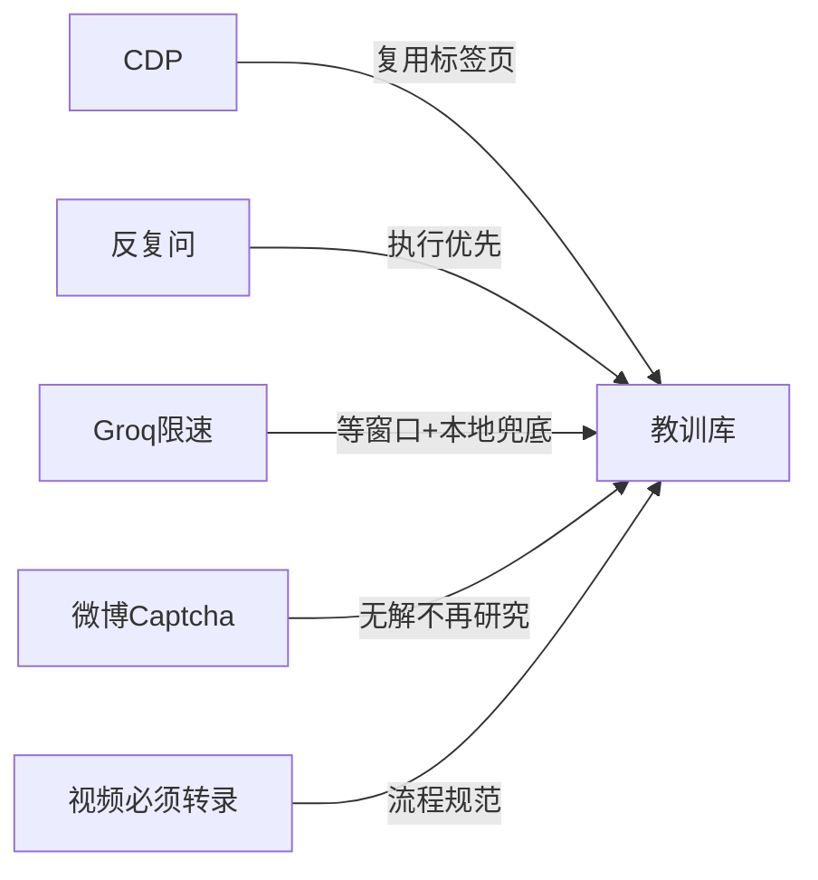
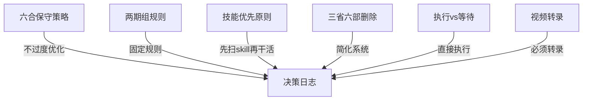
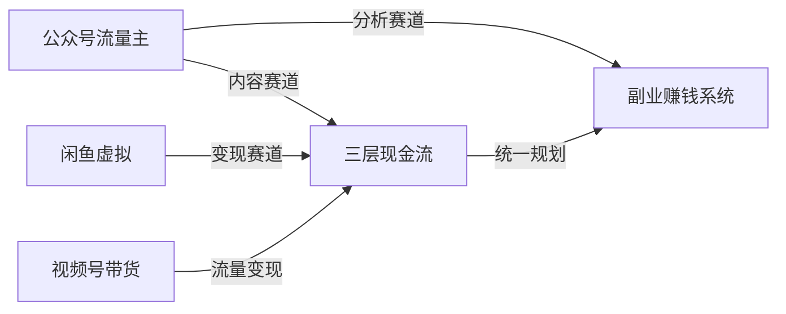
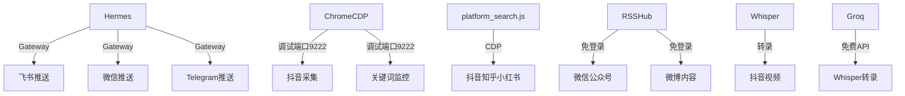
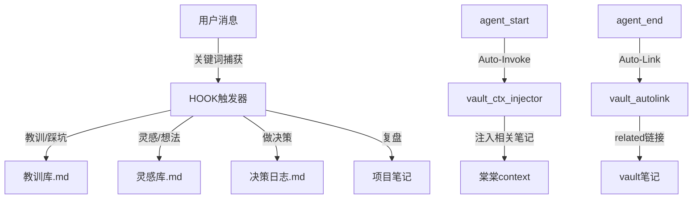

# 🧠 棠大脑关系图谱

> 棠棠所有笔记之间的关联地图。按主题聚类，线条表示关联方向。
> `←` 表示被关联，`→` 表示主动关联。

---

## 🔴 教训库（踩过的坑）

教训库是棠棠最核心的成长记录，所有新技术/新项目都从教训库里受益。



### 教训库内容

| 教训 | 日期 | 分类 |
|------|------|------|
| CDP连接新页面被抖音检测 | 2026-05-05 | 🔴高危 |
| 反复问确认 → 行为红线 | 2026-05-05 | 🔴高危 |
| Groq Whisper 窗口限速7200秒 | 2026-05-06 | 🔴高危 |
| 微博关键词 captcha HARD BLOCKER | 2026-05-05 | 🔴高危 |
| 抖音关键词 captcha 概率触发 | 2026-05-05 | 🟡中等 |
| Playwright CDP 沙盒隔离 | 2026-05-06 | 🟡中等 |
| WSL 代理环境变量 systemd不继承 | 2026-05-06 | 🟡中等 |
| 视频必须转录不许只看标题 | 2026-05-06 | 🟡中等 |

**关联笔记**：
- `教训库.md` ← `棠身份与性格.md`（棠棠行为准则）
- `教训库.md` ← `棠记忆库.md`（行为红线配置）
- `教训库.md` → `棠技能索引.md`（pitfalls 警示）

---

## 🔵 决策日志（重大选择）

每个决策都改变了棠棠的行为方式，形成现在的棠棠。



### 关键决策

| 决策 | 选项A | 选项B（选） | 日期 |
|------|------|------------|------|
| 六合保守策略 | 新策略OOS+8.8% | 保持原策略 | 2026-04 |
| 两期组规则 | 1期一组 | 2期一组 | 2026-04 |
| 技能优先原则 | 想到什么做什么 | 先扫skill | 2026-05-06 |
| 三省六部删除 | 保留更新路径 | 直接删除 | 2026-05-06 |
| 执行vs等待 | 分析后等确认 | 直接执行 | 2026-05-03 |
| B站字幕 | 全量Whisper | 直拿字幕降级 | 2026-05-06 |

**关联笔记**：
- `决策日志.md` ← `棠身份与性格.md`（执行优先写进性格）
- `决策日志.md` → `教训库.md`（决策导致教训，教训影响决策）

---

## 🟢 项目笔记（副业主航道）

主人在同时推进三个变现项目，形成三层现金流体系。



### 副业项目状态

| 项目 | 阶段 | 状态 |
|------|------|------|
| 公众号流量主 | 分析赛道 + 公众号采集 | 🔄进行中 |
| 闲鱼虚拟 | 变现方案设计 | 🔄进行中 |
| 视频号带货 | 流量变现方案 | 🔄进行中 |

**关联笔记**：
- `副业赚钱项目V2/` → `副业赚钱完整系统设计.md`
- `副业赚钱完整系统设计.md` → `公众号流量主赛道细分系统.md`
- `公众号流量主赛道细分系统.md` → `公众号赛道完整分析报告.md`
- `04_项目笔记/` → `03_知识库/灵感库.md`（副业灵感）

---

## ⚙️ 技术系统（工具链）

棠棠的工具链决定了她能做什么。



### 工具链状态

| 工具 | 状态 | 关键教训 |
|------|------|----------|
| Hermes Gateway | ✅ 运行中 | 教训库 |
| 飞书推送 | ✅ 运行中 | 反复配置多次 |
| 微信推送 | ✅ 运行中 | - |
| Telegram | ✅ 运行中 | - |
| Chrome CDP | ✅ 已登录4平台 | 必须复用标签页 |
| platform_search.js | ✅ 运行中 | captcha不稳定 |
| RSSHub | 🔄 部署中 | token限制 |
| Whisper转录 | ⏸️ 暂停 | Groq限速 |
| Groq Whisper | ⏸️ 限速中 | 7200秒/小时窗口 |

**关联笔记**：
- `棠技能索引.md` → 各工具对应skill
- `教训库.md` → 工具踩坑记录
- `关键词监控` → `棠记忆库.md`（技术配置）

---

## 🧠 知识管理系统（棠棠大脑）

HOOK上线后，棠棠的大脑开始真正运转。



### HOOK系统

| HOOK | 触发 | 作用 |
|------|------|------|
| `vault_ctx_injector` | agent:start | 任务前注入相关笔记 |
| `vault_autolink` | agent:end | 写完笔记自动建双向链接 |

### vault目录结构

```
棠大脑/
├── 棠身份与性格.md        ← SOUL备份，行为准则
├── 棠记忆库.md            ← MEMORY备份
├── 棠主人档案.md          ← USER备份
├── 棠技能索引.md          ← skill速查表
├── 棠大脑说明.md          ← vault导航
├── 灵感库.md              ← 灵感捕捉
├── 01_每日日志/           ← 每日工作记录
├── 02_工作记录/
│   ├── 教训库.md          ← 踩坑记录（高危/中等/已解决）
│   └── 决策日志.md         ← 重大选择记录
├── 03_知识库/
│   ├── 灵感库.md
│   └── 👤用户档案/
└── 04_项目笔记/
    ├── 副业赚钱项目V2/     ← 三层现金流体系
    └──胡说老王/            ← 内容采集项目
```

**关联笔记**：
- `棠大脑说明.md` → 所有主要笔记
- `棠技能索引.md` → `教训库.md`（pitfalls）
- `教训库.md` → `棠大脑说明.md`（核心系统之一）
- `灵感库.md` → `04_项目笔记/`（灵感触发项目）

---

## 📊 核心关系矩阵

<!-- backlinks -->
- [[棠大脑说明.md]]
- [[棠身份与性格.md]]
- [[教训库.md]]
- [[决策日志.md]]

| 源 | → | 目标 | 关系类型 |
|----|---|------|----------|
| 用户消息 | → | 教训库 | 关键词触发 |
| 用户消息 | → | 灵感库 | 关键词触发 |
| 用户消息 | → | 决策日志 | 关键词触发 |
| 教训库 | → | 棠技能索引 | pitfalls警示 |
| 决策日志 | → | 棠身份与性格 | 执行原则固化 |
| 副业项目 | → | 灵感库 | 项目关联 |
| HOOK1(Auto-Invoke) | → | vault所有笔记 | 上下文注入 |
| HOOK2(Auto-Link) | → | vault所有笔记 | 自动建链接 |
| 棠技能索引 | → | 各skill | 技能导航 |
| 各skill | → | 教训库 | 操作中踩坑 |

---

*此文件由棠棠维护，每段重大关联新增时更新*
*最后更新：2026-05-08*

---
related::
← [[棠身份与性格.md]]
← [[棠记忆库.md]]
← [[棠主人档案.md]]
← [[棠技能索引.md]]
← [[教训库.md]]
← [[决策日志.md]]
← [[棠大脑说明.md]]
← [[📜_棠大脑历史总览.md]]
← [[灵感库.md]]
← [[副业赚钱项目精选.md]]
← [[_SESSION_INDEX.md]]
← [[2026-05-06.md]]